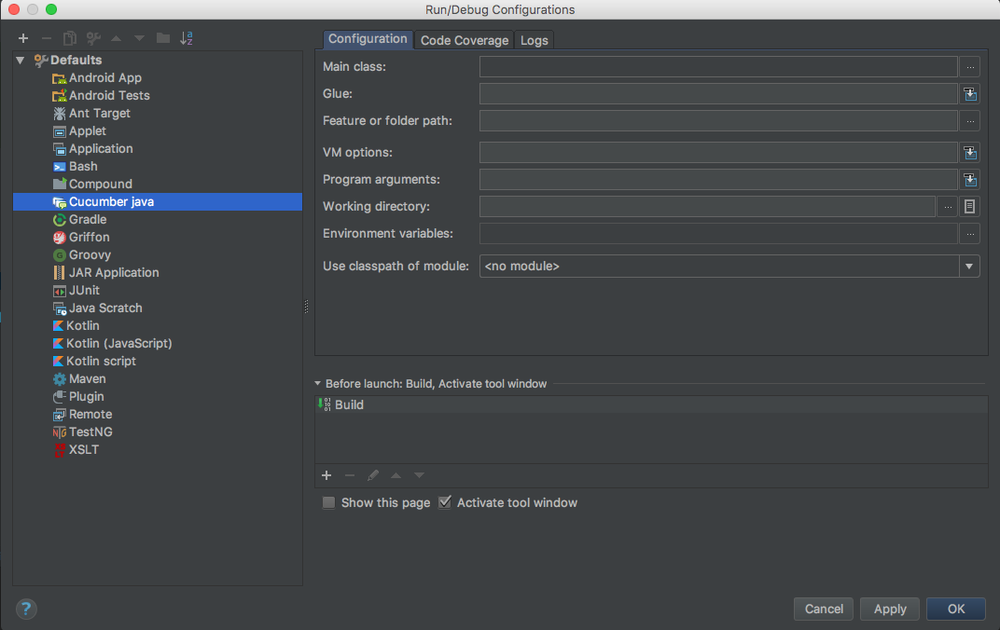
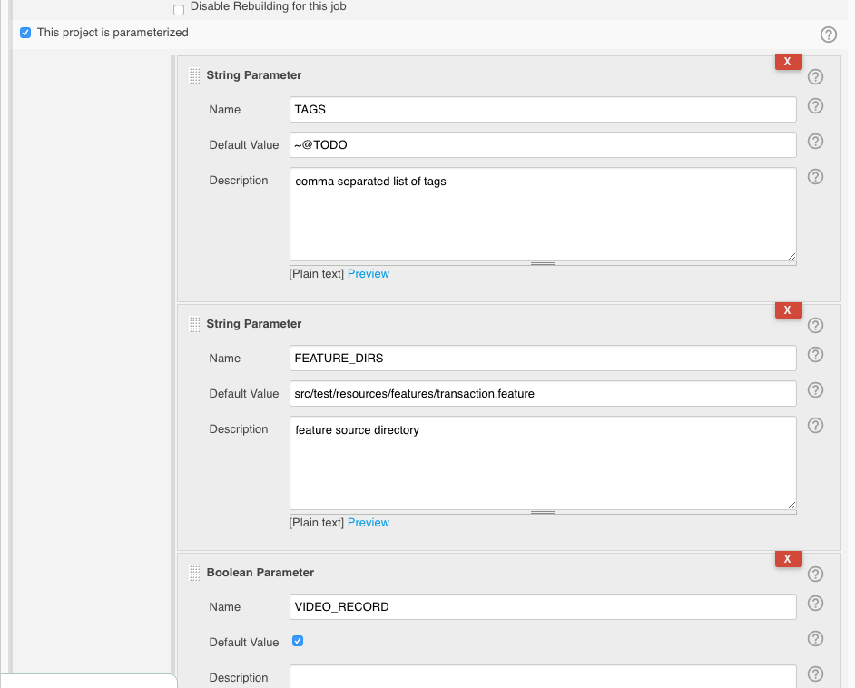
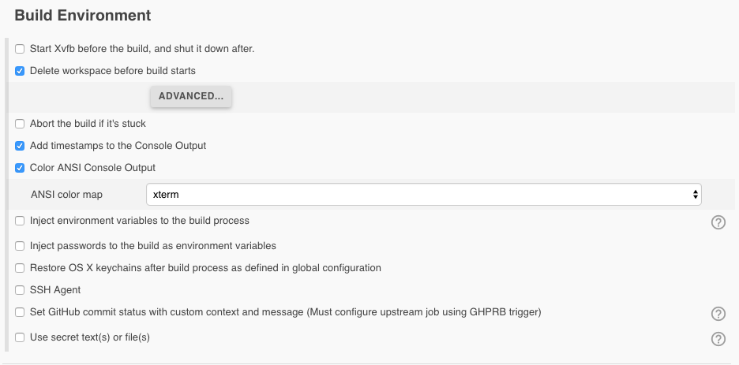
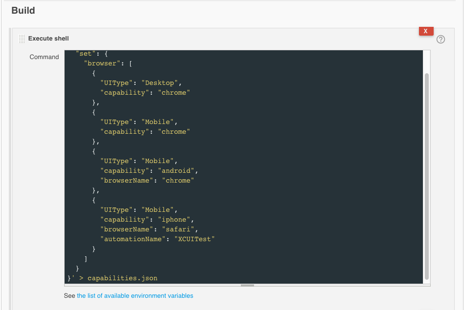
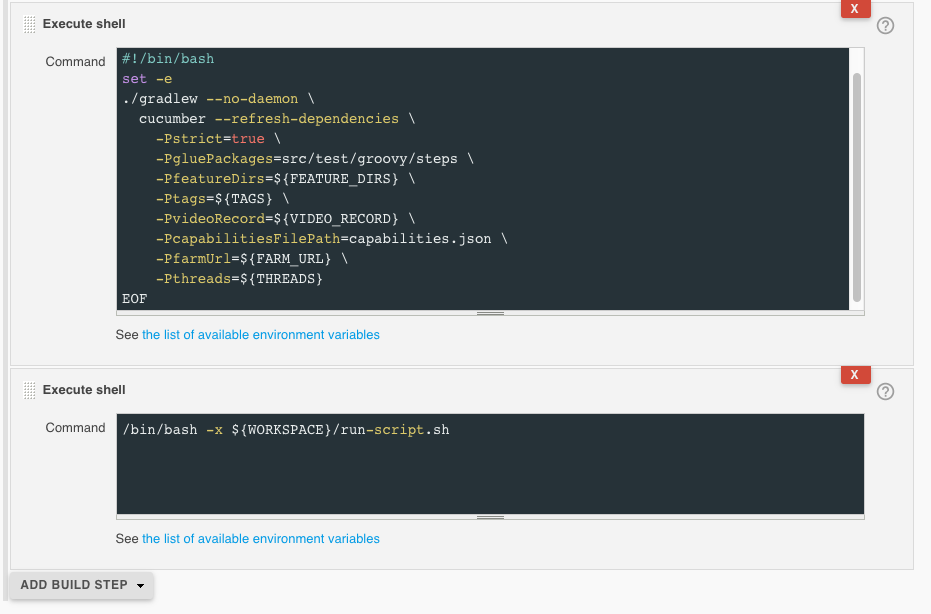
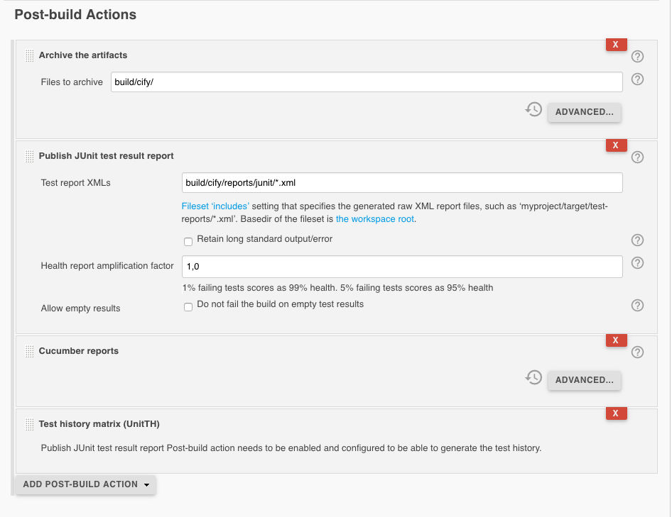

1. What Is SwagLab Test Automation project?
1. How the project structure looks like?
1. What are the preconditions?
1. Step-By-Step guide for beginners
1. How to run tests with Cify Framework?
1. How to configure tests with Cify Framework?
1. How to add new tests?
1. How to setup Jenkins Job for Test Automation?
1. Learn more about Cify Framework

## What Is SwagLab Test Automation project?
SwagLab Test Automaton Project is a mobile automation project. This project is used on 2019 Nordic Testing Day workshop called: Mobile Test Automation Using Cify Open-Source Framework.
 
https://nordictestingdays.eu/events/workshops/mobile-test-automation-using-cify-open-source-framework
 
## How the project structure looks like?

### Project structure overview
```
    /
    |-- build
    |   |-- cify
    |       |-- log
    |-- gradle
    |   |-- wrapper
    |-- src
    |   |-- test
    |       |-- groovy
    |           |-- impl
    |           |-- steps
    |       |-- resources
    |           |-- features
    |           |-- introduction
    |-- build.gradle
    |-- fullsuite.properties
    |-- capabilities.json
    |-- configuration.json
    |-- data.json
    |-- README.md
```

**build/cify/log/** - Project logs  
**gradle/wrapper/** - Gradle wrapper  
**src/test/groovy/impl** - Implementation layer, client specific implementation  
**src/test/groovy/steps** - Cucumber step definitions  
**src/test/resources/features** - Cucumber Feature files  
**src/test/resources/introduction** - Sample images for README    
**fullsuite.properties** - Project parameters for fullsuite execution  
**capabilities.json** - Device list for full execution  
**configuration.json** - Device information for local right-click-and-play execution  
**data.json** - Client specific test data for automation scripts.

## What are the preconditions?

* Java 8
* Appium is installed
* Android device
* iOS device
* IntelliJ IDEA (or similar IDE)

## Step-By-Step guide for beginners

### Run clean build to make sure that everything is okay

Just to make sure that everything is in order run gradle clean build task  

**On Mac OS X**  
``./gradlew build`` 
 
**On Windows**  
``gradlew build``  

### Download plugins for IDEA

* Gherkin
* Cucumber for Java
* Cucumber for Groovy

### Add run configuration to IDE

* Open Run/Debug configurations on IntelliJ or Android Studio
* Select Cucumber for Java from defaults
* Set **src/test/groovy/steps** as a Glue
* Press OK



## How to run tests with Cify Framework?

Options for running tests with Cify Framework:
* Right click and play (plug-and-play)
* Run from command line (cify-runner)

Default device configuration is (configuration.json): 

```
{
  "videoRecord": false,
  "videoDir": "build/cify/videos/",
  "capabilities": {
    "android": {
      "capabilityId": "GalaxyS6",
      "capability": "android",
      "platform": "ANDROID",
      "UIType": "MobileAndroidApp",
      "browserName": "android",
      "deviceName": "Android Device",
      "app": "src/test/resources/applications/application.apk"
    }
  }
}

```

### Plug-And-Play

#### Precondition for plug-and-play

Plug-and-play will use **configuration.json** for configuration file.

#### Steps

1. Navigate to Cucumber Feature file that you would like to run
1. Find Scenario you would like to run
1. Right click on Scenario/Right click on Feature
1. Click Run

### With Cify Runner

Cify funner will use **capabilities.json** and **.properties** files for configuration.

Runner gives multiple options to trigger tests and test suites.

Gradle wrapper is used in the project. We can trigger gradle tasks like following:

* ./gradlew <task> (on Unix-like platforms such as Linux and Mac OS X)
* gradlew <task> (on Windows using the gradlew.bat batch file)

#### Run specific cucumber tag

Running the command below will trigger all scenarios with add tag and exclude all TODO tags.

``
  ./gradlew cucumber -PfeatureDirs=src/test/resources/features -PgluePackages=src/test/groovy/steps -Ptags=@add,~@TODO
``

#### Run with properties file

Users can specify all the parameters required for Cify Runner from properties file.  
Running with properties file:

``
 ./gradlew cucumber -Penv=fileName
``

NB! If file name is "local.properties" then user should enter only "local".

#### Run specific capabilities JSON

Sometimes there are needed multiple capabilities files, one for each suite. Then user can specify with command line parameter which capabilities file to use.

``
    ./gradlew cucumber -PcapabilitiesFilePath=src/test/resources/capabilities/someCapabilities.json
``

## How to configure tests with Cify Framework?

### Default configuration

### How to configure?

User can change **configuration.json** to any capability which is needed.  
Example of configuration.json file  
```
{
   "videoRecord": false,
   "videoDir": "build/cify/videos/",
   "capabilities": {
     "android": {
       "capability": "android",
       "deviceName": "Android",
       "version": "ANY"
     },
     "browser": {
       "capability": "firefox"
     },
     "ios": {
       "capability": "iphone",
       "deviceName": "iPhone",
       "version": "ANY"
     }
   }
 }
```

**videoRecord** - Enable web driver video recording.  
**videoDir** - Directory where videos are saved.  
**capabilities** - Are used when user right clicks on scenarios or feature and press run. Capability with given category is taken and triggered.  

### Capabilities (Runner)

Capabilities file is in JSON format and defines capabilities for suite. Users can pass parameters to devices with capabilities json file.

File contains two objects:
* defaults
* set

#### Defaults 

Defaults is a optional parameter in capabilities json. User can define capabilities for 3 device categories (browser, android, iOS). If default is defined for one category then it will be added to every capability variation (if not defined in the set). 

#### Set

Set is a list of capabilities to test against. User can define as much capabilities for each device category as needed. Runner will create variations that every capability is tested with every other capabilities from other category.  

Valid capability file structure:
```
 {
   "set": {
     "android": [
       {
          "capability": "android",
          "UIType": "MobileAndroidApp",
          "deviceName": "First Android device",
          "app": "src/test/resources/applications/app.apk"
       },
       {
          "capability": "android",
          "UIType": "MobileAndroidApp",
          "deviceName": "Second Android device",
          "app": "src/test/resources/applications/app.apk"       },
       {
          "capability": "android",
          "UIType": "MobileAndroidApp",
          "deviceName": "Third Android device",
          "app": "src/test/resources/applications/app.apk"       
       }
     ]
   }
 }
```
In this case there would be 4 different suites. One for each device in the list.

## How to add new tests?

### Cucumber
Cucumber features are located in src/test/resources/features folder.  
Users can add features like default cucumber requires.  
Add **@TODO** tag to feature or scenario when it's not implemented.  

```
@TODO
Scenario: Verify LiveTV view
    Given user opens Android application
    And user dismisses notifications
    And user taps cancel on login popup
    And user skips tutorial
    And user opens menu
    And user taps Live TV in menu
    When user scrolls DOWN on the live TV view
    Then Live TV view scrolls correctly
```

### Step definitions

Step definitions are located in **src/test/groovy/steps** folder.  
Users can add step definitions like default cucumber requires.

```
And(~/^user scrolls (.*) on the categories view$/) { String direction ->
    ActionsImpl.getCategoriesActions().scrollProgramList(direction)
}
```

### Implementation

Create interface for needed class Example:
```
trait IFavouritesActions {

    FavouritesPageObjects favouritesPageObjects
    Device device

    /**
     * Scrolls the favourite channel list in given direction. Title of the first program in list is
     * saved to the TestDataManager.
     * @param direction scroll direction: UP, DOWN, LEFT, RIGHT
     */
    void scrollFavouritesChannelList(String direction) {
        setTestData(FIRST_PROGRAM_TITLE, favouritesPageObjects.getRowTitle().getText())
        scrollElement(device, favouritesPageObjects.getChannelList(), direction)
    }
}

```

Implement this interface with available UITypes (Currently there are three: DesktopWeb, MobileAndroidApp, MobileIOSApp)
```
class FavouritesActionsMobileAndroidApp implements IFavouritesActions {

    FavouritesActionsMobileAndroidApp(Device device) {
        this.device = device
        this.favouritesPageObjects = new FavouritesPageObjects()
    }
}
```

Add new class to ActionsImpl class.

```
    /**
     * Gets Favourite actions for current device
     * @return IFavouritesActions class instance
     */
    static IFavouritesActions getFavouritesActions() {
           (IFavouritesActions) getCustomActions(DeviceManager.getInstance().getActiveDevice(TestDataManager.getActiveDevice()), IMPLEMENTATION_PACKAGE + "favourites.actions.FavouritesActions")
       }

```


### Page Objects

Page objects hold all the elements that tests need.

```
class FavouritesPageObjects extends PageObjects {

    FavouritesPageObjects() {
        super(DeviceManager.getInstance().getActiveDevice())
    }

    @AndroidFindBy(id = "programs_list_view")
    WebElement channelList

    @AndroidFindBy(id = "vod_channel_row_title")
    WebElement rowTitle

    @AndroidFindBy(id = "tabs")
    WebElement tabSection

    By tabTitles = By.className("android.widget.TextView")

    @AndroidFindBy(id = "programs_list_view")
    WebElement programsList

    @AndroidFindBy(id = "program_name")
    WebElement programTitle

    @AndroidFindBy(id = "program_date")
    WebElement programDate

}

```

## How to setup Jenkins Job for Test Automation?

Cify Runner can be used in Jenkins as a default Gradle project.  

### Preconditions

1. Jenkins with version 2.23+
1. Gradle plugin installed on Jenkins

### Step-By-Step guide

1. Create freestyle project
1. Check "Delete workspace before build starts" in Build Environment
1. Add build step "Invoke Gradle script"
1. Select use gradle wrapper
1. Insert "cucumber" with all the parameters you need into Tasks input

``
Example: cucumber -Penv=demo -PfarmUrl=http://localhost:4444/wd/hub
``

### Cucumber HTML reports with Cify Runner

Users can use default Cucumber HTML report.

Cucumber reports plugin can be found in: [Cucumber reports plugin](https://github.com/jenkinsci/cucumber-reports-plugin)

Cucumber reports are saved by default to **build/cify/reports**


### Demonstrative pictures about Jenkins setup












## Learn more about Cify Framework

**Cify Framework**  
Framework is responsible for managing communication with devices, and handling device actions (click, touch, tap, fillIn, sendKeys etc.) independently from device platform.  
Learn more from [GitHub](https://github.com/fobsolutions/cify-framework)  
**Cify Runner**  
Runner is responsible for parameters management, test configuration and test execution.  
Learn more from [GitHub](https://github.com/fobsolutions/cify-runner)    
**Cify Device Farm**  
Device Farm provides cross platform Selenium grid nodes.  
Learn more from [GitHub](https://github.com/fobsolutions/cify-device-farm)    